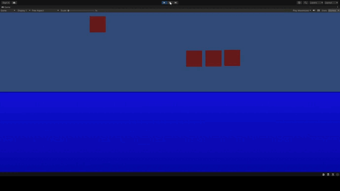

# Unity2D-physical-dynamic-water

A project showing the implementation of physical dynamic water with a side view in Unity 2D
Проект, показывающий реализацию физической динамической воды с видом сбоку в Unity2D

Особенности:
1. Динамичная линия поверхности воды, реагирующая на удары
2. Алгоритм плавания тел на поверхности воды
Features:
1. Dynamic water surface line reacting to impacts
2. Algorithm for floating bodies on the water surface

Credits:
1.
https://tproger.ru/translations/creating-dynamic-2d-water-effects-in-unity/

2.
https://www.youtube.com/watch?v=eL_zHQEju8s
https://habr.com/ru/post/309036/

